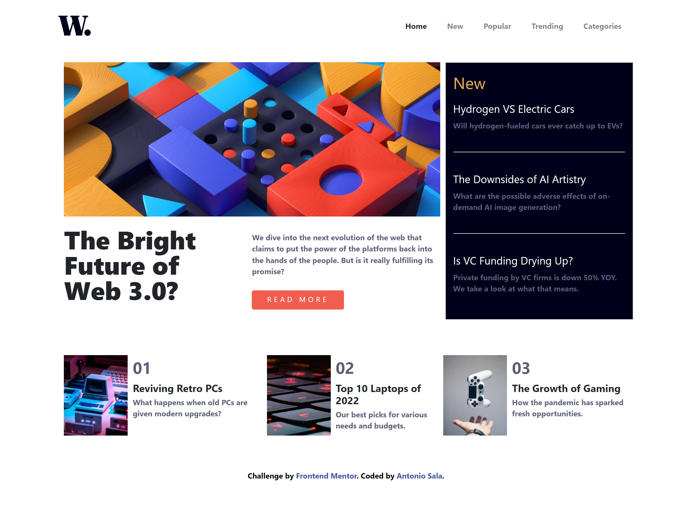

# Frontend Mentor - News homepage solution. 

## Table of contents

- Overview
  - The challenge
  - Screenshot
  - Links
- My process
  - Built with
- Author

## Overview

### The challenge

Users should be able to:

- View the optimal layout for the interface depending on their device's screen size
- See hover and focus states for all interactive elements on the page

### Screenshot

### Links

- Solution URL: https://github.com/Antho137/news-homepage
- Live Site URL: https://antho137.github.io/news-homepage/

## My process

### Built with

- Semantic HTML5 markup
- CSS custom properties
- Flexbox
- CSS Grid
- Mobile-first workflow
- Bootstrap
- jQuery (menu)

## Author

- Website - "https://antoniosala.online"
- Frontend Mentor - "https://www.frontendmentor.io/profile/yourusername"
- Twitter - "https://www.twitter.com/antoniosala73"